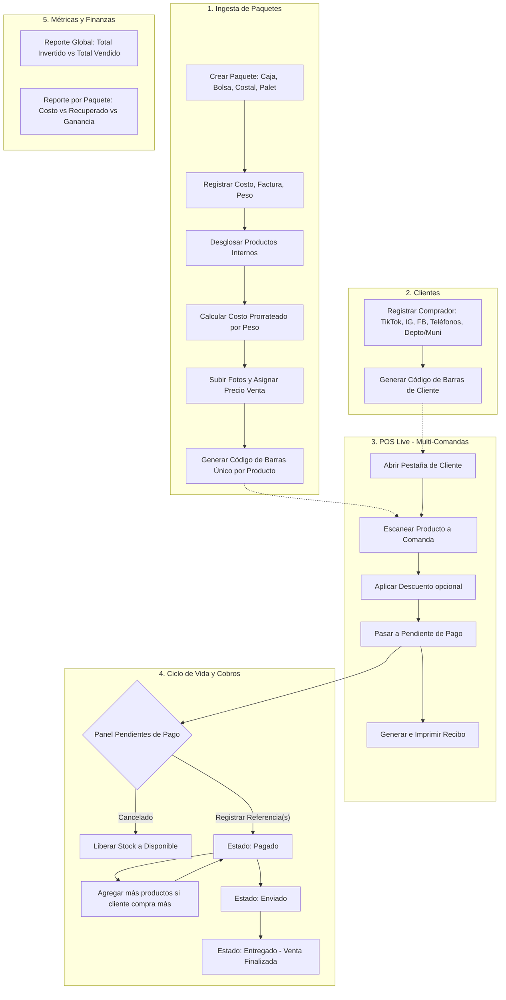
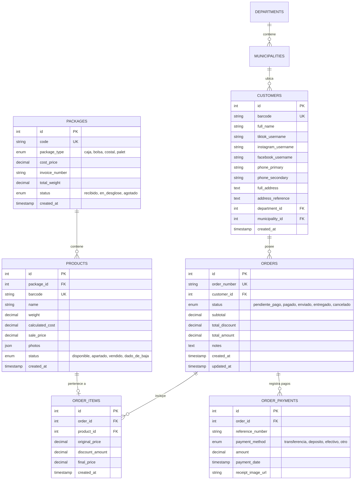
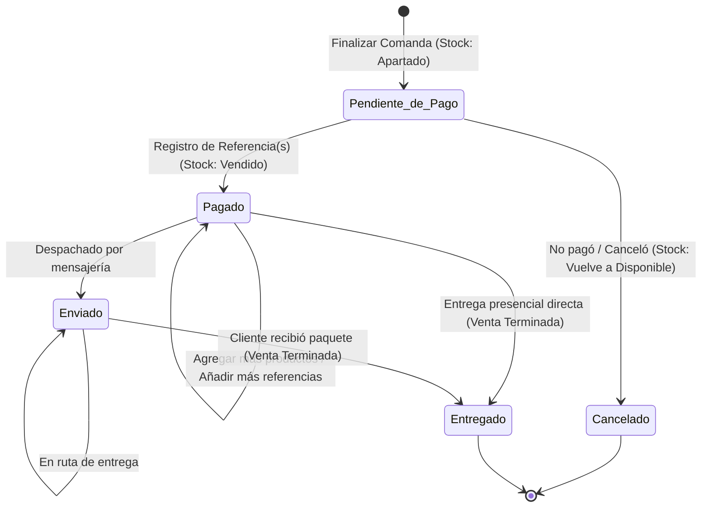

# Especificación Técnica y Funcional: Plataforma Web de Gestión de Inventario, POS y Ventas en Vivo
**Proyecto:** Alegra Inventory & POS (Alegra_inv_ag)  
**Versión:** 1.0.0  
**Fecha:** 2026-09-26  
**Estado:** Propuesta de Especificación Formal  

---

## 1. Visión General del Proyecto

### 1.1 Objetivo
Desarrollar una plataforma web integral, ágil y minimalista orientada al modelo de negocio de la tienda **Alegra**, especializada en la adquisición de lotes/paquetes cerrados (cajas, bolsas, costales, pallets) y su venta al detalle, comúnmente dinamizada a través de transmisiones en vivo (Live Shopping en TikTok, Instagram y Facebook).

El sistema cubrirá todo el ciclo operativo:
1. **Recepción e Ingesta:** Registro de paquetes con factura, costo y peso, desglosando productos con peso individual, costo prorrateado, fotos, precio de venta y códigos de barras únicos.
2. **Directorio de Clientes / Compradores:** Perfiles con redes sociales (TikTok, Instagram, Facebook), teléfonos, ubicación geográfica detallada de Guatemala (Departamento y Municipio) y código de barras propio.
3. **Punto de Venta Dinámico Multi-Comanda (POS Live):** Múltiples cuentas abiertas en simultáneo para alternar rápidamente entre clientes mientras se escanean productos en transmisiones en vivo. Descuentos por producto y emisión de tickets/recibos de apartado.
4. **Gestión de Cobros y Logística de Pedidos:** Ciclo de estados (*Pendiente de Pago* $\rightarrow$ *Pagado* $\rightarrow$ *Enviado* $\rightarrow$ *Entregado* / *Cancelado*), soporte para múltiples referencias de pago por orden, adición de productos antes del despacho y liberación automática de stock ante cancelaciones.
5. **Métricas de Rentabilidad e Inversión:** Reportes financieros globales y por paquete para identificar el punto de equilibrio (recuperación de inversión) y margen de ganancia real por lote.

### 1.2 Identidad Visual y Diseño Minimalista
* **Color Primario (Dominante / Estructura):** `#233142` (Azul Noche / Pizarra Profundo) – Usado en barras de navegación, encabezados, botones principales y estados activos.
* **Color Secundario / Acento:** `#D6B89C` (Arena Cálido / Beige Suave) – Usado en badges, bordes sutiles, botones secundarios, acentos de selección y elementos destacados.
* **Fondos y Superficies:**
  * Fondo general: `#F8F9FA` (Blanco Humo suave para descanso visual).
  * Contenedores / Tarjetas: `#FFFFFF` con sombras suaves (`box-shadow: 0 1px 3px rgba(0,0,0,0.06)`).
  * Bordes: `#E5E7EB` (Gris tenue).
* **Colores Semánticos para Estados:**
  * *Pendiente de Pago:* `#E67E22` (Ámbar cálido).
  * *Pagado:* `#27AE60` (Verde esmeralda).
  * *Enviado:* `#2980B9` (Azul cobalto).
  * *Entregado:* `#16A085` (Turquesa / Éxito final).
  * *Cancelado:* `#C0392B` (Rojo teja).

---

## 2. Arquitectura del Sistema

### 2.1 Pila Tecnológica Recomendada
* **Frontend:** Web SPA / SSR responsivo (React / Next.js con Tailwind CSS para el sistema de diseño minimalista).
* **Backend:** API REST / Server Actions estructurado con TypeScript / Node.js o PHP / Laravel.
* **Base de Datos:** **MySQL 8.0+** (Motor InnoDB con soporte para transacciones ACID, índices optimizados y constraints de integridad referencial).
* **Generación de Códigos de Barras:** Librería estándar (ej. `JsBarcode` / `BWIP-JS` para Code-128).
* **Almacenamiento de Multimedia:** S3 Compatible o almacenamiento local estático optimizado con compresión WebP.

### 2.2 Diagrama de Flujo del Negocio



---

## 3. Modelo de Datos y Esquema MySQL

### 3.1 Diagrama Entidad-Relación (ERD)



### 3.2 Script DDL de Base de Datos MySQL (Estructura Completa)

```sql
-- Creación de la Base de Datos
CREATE DATABASE IF NOT EXISTS alegra_db 
CHARACTER SET utf8mb4 
COLLATE utf8mb4_unicode_ci;

USE alegra_db;

-- -----------------------------------------------------
-- 1. Tabla de Departamentos de Guatemala
-- -----------------------------------------------------
CREATE TABLE IF NOT EXISTS departments (
    id INT AUTO_INCREMENT PRIMARY KEY,
    name VARCHAR(100) NOT NULL UNIQUE
) ENGINE=InnoDB;

-- -----------------------------------------------------
-- 2. Tabla de Municipios de Guatemala
-- -----------------------------------------------------
CREATE TABLE IF NOT EXISTS municipalities (
    id INT AUTO_INCREMENT PRIMARY KEY,
    department_id INT NOT NULL,
    name VARCHAR(100) NOT NULL,
    FOREIGN KEY (department_id) REFERENCES departments(id) ON DELETE RESTRICT,
    UNIQUE KEY uk_dept_muni (department_id, name)
) ENGINE=InnoDB;

-- -----------------------------------------------------
-- 3. Tabla de Paquetes / Lotes (Ingesta principal)
-- -----------------------------------------------------
CREATE TABLE IF NOT EXISTS packages (
    id INT AUTO_INCREMENT PRIMARY KEY,
    code VARCHAR(30) NOT NULL UNIQUE COMMENT 'Identificador visible ej. PKG-2026-001',
    package_type ENUM('caja', 'bolsa', 'costal', 'palet') NOT NULL,
    cost_price DECIMAL(12,2) NOT NULL DEFAULT 0.00 COMMENT 'Costo de adquisición total',
    invoice_number VARCHAR(100) NOT NULL COMMENT 'Número de factura de compra',
    total_weight DECIMAL(10,3) NULL DEFAULT NULL COMMENT 'Peso en libras o kg',
    status ENUM('recibido', 'en_desglose', 'agotado') NOT NULL DEFAULT 'recibido',
    notes TEXT NULL,
    created_at TIMESTAMP DEFAULT CURRENT_TIMESTAMP,
    updated_at TIMESTAMP DEFAULT CURRENT_TIMESTAMP ON UPDATE CURRENT_TIMESTAMP
) ENGINE=InnoDB;

-- -----------------------------------------------------
-- 4. Tabla de Productos Desglosados del Paquete
-- -----------------------------------------------------
CREATE TABLE IF NOT EXISTS products (
    id INT AUTO_INCREMENT PRIMARY KEY,
    package_id INT NOT NULL,
    barcode VARCHAR(64) NOT NULL UNIQUE COMMENT 'Código escaneable único (Code128)',
    name VARCHAR(255) NOT NULL COMMENT 'Descripción o nombre del artículo',
    weight DECIMAL(10,3) NULL DEFAULT NULL COMMENT 'Peso individual del artículo',
    calculated_cost DECIMAL(12,2) NULL DEFAULT 0.00 COMMENT 'Costo proporcional calculado por peso',
    sale_price DECIMAL(12,2) NOT NULL COMMENT 'Precio de venta al público',
    photos JSON NULL COMMENT 'Lista de URLs de imágenes del producto',
    status ENUM('disponible', 'apartado', 'vendido', 'dado_de_baja') NOT NULL DEFAULT 'disponible',
    created_at TIMESTAMP DEFAULT CURRENT_TIMESTAMP,
    updated_at TIMESTAMP DEFAULT CURRENT_TIMESTAMP ON UPDATE CURRENT_TIMESTAMP,
    FOREIGN KEY (package_id) REFERENCES packages(id) ON DELETE RESTRICT,
    INDEX idx_products_barcode (barcode),
    INDEX idx_products_status (status)
) ENGINE=InnoDB;

-- -----------------------------------------------------
-- 5. Tabla de Compradores / Clientes
-- -----------------------------------------------------
CREATE TABLE IF NOT EXISTS customers (
    id INT AUTO_INCREMENT PRIMARY KEY,
    barcode VARCHAR(64) NOT NULL UNIQUE COMMENT 'Código de barras de cliente CLI-XXXXX',
    full_name VARCHAR(150) NOT NULL,
    tiktok_username VARCHAR(100) NULL,
    instagram_username VARCHAR(100) NULL,
    facebook_username VARCHAR(100) NULL,
    phone_primary VARCHAR(25) NOT NULL COMMENT 'Teléfono principal obligatorio',
    phone_secondary VARCHAR(25) NULL COMMENT 'Teléfono secundario opcional',
    full_address TEXT NOT NULL,
    address_reference TEXT NULL COMMENT 'Punto de referencia de entrega',
    department_id INT NOT NULL,
    municipality_id INT NOT NULL,
    created_at TIMESTAMP DEFAULT CURRENT_TIMESTAMP,
    updated_at TIMESTAMP DEFAULT CURRENT_TIMESTAMP ON UPDATE CURRENT_TIMESTAMP,
    FOREIGN KEY (department_id) REFERENCES departments(id) ON DELETE RESTRICT,
    FOREIGN KEY (municipality_id) REFERENCES municipalities(id) ON DELETE RESTRICT,
    INDEX idx_customers_phone (phone_primary),
    INDEX idx_customers_social (tiktok_username, instagram_username, facebook_username)
) ENGINE=InnoDB;

-- -----------------------------------------------------
-- 6. Tabla de Comandas / Órdenes
-- -----------------------------------------------------
CREATE TABLE IF NOT EXISTS orders (
    id INT AUTO_INCREMENT PRIMARY KEY,
    order_number VARCHAR(30) NOT NULL UNIQUE COMMENT 'Folio ej. CMD-2026-0001',
    customer_id INT NOT NULL,
    status ENUM('pendiente_pago', 'pagado', 'enviado', 'entregado', 'cancelado') NOT NULL DEFAULT 'pendiente_pago',
    subtotal DECIMAL(12,2) NOT NULL DEFAULT 0.00,
    total_discount DECIMAL(12,2) NOT NULL DEFAULT 0.00,
    total_amount DECIMAL(12,2) NOT NULL DEFAULT 0.00,
    notes TEXT NULL,
    created_at TIMESTAMP DEFAULT CURRENT_TIMESTAMP,
    updated_at TIMESTAMP DEFAULT CURRENT_TIMESTAMP ON UPDATE CURRENT_TIMESTAMP,
    FOREIGN KEY (customer_id) REFERENCES customers(id) ON DELETE RESTRICT,
    INDEX idx_orders_status (status),
    INDEX idx_orders_customer (customer_id)
) ENGINE=InnoDB;

-- -----------------------------------------------------
-- 7. Tabla Detalle de la Comanda (Items)
-- -----------------------------------------------------
CREATE TABLE IF NOT EXISTS order_items (
    id INT AUTO_INCREMENT PRIMARY KEY,
    order_id INT NOT NULL,
    product_id INT NOT NULL,
    original_price DECIMAL(12,2) NOT NULL COMMENT 'Precio base al momento de escanear',
    discount_amount DECIMAL(12,2) NOT NULL DEFAULT 0.00 COMMENT 'Monto de descuento aplicado al producto',
    final_price DECIMAL(12,2) NOT NULL COMMENT 'original_price - discount_amount',
    created_at TIMESTAMP DEFAULT CURRENT_TIMESTAMP,
    FOREIGN KEY (order_id) REFERENCES orders(id) ON DELETE CASCADE,
    FOREIGN KEY (product_id) REFERENCES products(id) ON DELETE RESTRICT,
    INDEX idx_order_items_product (product_id)
) ENGINE=InnoDB;

-- -----------------------------------------------------
-- 8. Tabla de Pagos y Referencias Múltiples
-- -----------------------------------------------------
CREATE TABLE IF NOT EXISTS order_payments (
    id INT AUTO_INCREMENT PRIMARY KEY,
    order_id INT NOT NULL,
    reference_number VARCHAR(100) NOT NULL COMMENT 'Boleta depósito, num autorización transferencia',
    payment_method ENUM('transferencia', 'deposito', 'efectivo', 'otro') NOT NULL DEFAULT 'transferencia',
    amount DECIMAL(12,2) NOT NULL,
    payment_date TIMESTAMP DEFAULT CURRENT_TIMESTAMP,
    notes VARCHAR(255) NULL,
    FOREIGN KEY (order_id) REFERENCES orders(id) ON DELETE CASCADE,
    INDEX idx_payment_ref (reference_number)
) ENGINE=InnoDB;
```

---

## 4. Especificación Funcional Detallada

### 4.1 Módulo 1: Gestión de Paquetes e Ingesta de Inventario
1. **Alta de Paquete Madre:**
   * **Tipos de contenedor:** Selector entre `Caja`, `Bolsa`, `Costal`, `Palet`.
   * **Campos obligatorios:** Precio de costo total ($Q$), Número de factura.
   * **Campos opcionales:** Peso total del paquete (kg o lb).
   * Generación automática de identificador de paquete (ej. `PKG-0001`).
2. **Desglose de Contenido (Productos Internos):**
   * Una vez creado el paquete con su ID, la interfaz permite añadir artículos individuales pertenecientes a dicho paquete.
   * **Peso del producto:** Opcional.
   * **Cálculo de Costo Prorrateado por Peso:**
     $$\text{Costo Producto} = \frac{\text{Peso del Producto}}{\text{Peso Total del Paquete}} \times \text{Costo Total del Paquete}$$
     *Si no se ingresó peso al paquete o al producto, el sistema permite prorratear uniformemente entre la cantidad estimada de unidades o ingresar un costo base manual.*
   * **Fotografías:** Subida rápida (drag & drop o captura de cámara directa) para catálogo visual.
   * **Precio de Venta al Público:** Establecido por el usuario.
   * **Generador de Código de Barras:**
     * Formato Code-128 con estructura: `PRD-{PACKAGE_ID}-{PRODUCT_ID}` (ej. `PRD-0042-0189`).
     * Permite impresión directa en rollo térmico (ej. 50x30mm o 40x25mm).

---

### 4.2 Módulo 2: Registro y Perfiles de Compradores (CRM de Redes Sociales)
Pensado para dinamismo en transmisiones en vivo:
1. **Identificadores Sociales:**
   * Nombre completo del cliente (Obligatorio).
   * Nombre de usuario en TikTok (`@usuario`).
   * Nombre de usuario en Instagram (`@usuario`).
   * Nombre de perfil en Facebook.
2. **Contacto y Logística:**
   * Teléfono principal (Obligatorio - para WhatsApp de confirmación).
   * Teléfono secundario (Opcional).
   * Dirección completa + Punto de referencia específico.
   * **Departamento y Municipio (Guatemala):** Dropdowns interconectados con los 22 departamentos oficiales (Guatemala, Quetzaltenango, Sacatepéquez, Escuintla, etc.) y sus respectivos municipios.
3. **Código de Barras de Comprador:**
   * Formato: `CLI-{CUSTOMER_ID}` (ej. `CLI-00085`).
   * Imprimible para carnet de cliente frecuente o etiquetas de paquetes de envío.

---

### 4.3 Módulo 3: Punto de Venta Dinámico Multi-Comanda (Live Streaming POS)
Durante un "Live", el vendedor atiende a múltiples personas simultáneamente sin esperar a que un cliente cierre su compra antes de atender al siguiente.

1. **Gestión de Cuentas Simultáneas (Pestañas de Comanda):**
   * Barra superior de pestañas con acceso rápido a clientes activos.
   * Botón `[+ Nueva Comanda]`: Abre un modal rápido para seleccionar un cliente por escaneo de código de barras de cliente, búsqueda rápida por teléfono o búsqueda por `@usuario` de TikTok/Instagram/Facebook.
   * Cada pestaña muestra: Nombre del cliente, número de prendas/artículos escaneados y total acumulado actual.
2. **Lectura Ininterrumpida por Escáner:**
   * El cursor se mantiene siempre en el campo de escaneo (`auto-focus`).
   * Al escanear el código de un producto:
     * Valida que el producto exista y esté en estado `disponible`.
     * Lo añade automáticamente a la comanda activa.
     * Cambia temporalmente su estado a `apartado` (bloqueado para otros clientes).
3. **Descuento por Producto:**
   * Cada fila de producto en la comanda tiene un campo de descuento en monto (ej. $-Q15.00$).
   * Desglose visual en tiempo real:
     $$\text{Precio Final} = \text{Precio Base} - \text{Monto Descuento}$$
   * Resumen al pie de la comanda: Subtotal, Descuento Total, Total a Pagar.
4. **Cierre de Venta en Vivo:**
   * Botón destacado `[Finalizar Venta]`.
   * Pasa la orden inmediatamente al estado **`Pendiente de Pago`**.
   * Cierra la pestaña de la comanda y deja la pantalla lista para continuar vendiendo a los demás clientes.
   * **Emisión de Recibo:**
     * Opción de impresión térmica de 58mm/80mm.
     * Opción de "Compartir Recibo": Genera imagen o PDF descargable con logo de Alegra, detalle de artículos, descuentos, subtotal y cuentas bancarias para enviar instantáneamente por WhatsApp.

---

### 4.4 Módulo 4: Ciclo de Vida de Pedidos, Cobranzas y Logística

#### Máquina de Estados de la Orden



1. **Panel de Cuentas Pendientes de Pago:**
   * Vista en formato lista/kanban con filtro por fecha y antigüedad (para controlar apartados vencidos).
   * Muestra artículos apartados, total adeudado y accesos directos de contacto (botón de WhatsApp directo al teléfono del cliente).
2. **Transición: Pendiente de Pago $\rightarrow$ Pagado:**
   * Requiere registrar al menos una referencia de pago (No. de boleta, transferencia, comprobante de depósito).
   * El sistema soporta **múltiples referencias de pago** para una misma orden (ej. pago dividido en 2 depósitos).
   * Al confirmarse el pago:
     * Los productos pasan de `apartado` a `vendido` y se retiran permanentemente del listado disponible.
3. **Transición: Pendiente de Pago $\rightarrow$ Cancelado:**
   * Si el cliente no concreta el pago, se hace clic en `[Cancelar Cuenta]`.
   * Los productos se liberan al instante: su estado regresa a `disponible` para poder volver a escanearlos en futuras ventas.
4. **Regla de Negocio Crítica (Venta Dinámica y Agregados):**
   * **Antes de pasar a `Enviado` o `Entregado`:**
     * Es posible seguir agregando productos a la orden si el cliente pide más prendas en transmisiones posteriores o por mensaje.
     * Se recalculan los totales y se pueden adjuntar nuevas referencias de pago adicionales.
5. **Transición: Pagado $\rightarrow$ Enviado o Entregado:**
   * **Opción A: `Enviado`:** Se registra guía de envío o empresa de paquetería (Guatex, Cargo Expreso, Mensajería propia). Queda en espera hasta confirmación de entrega.
   * **Opción B: `Entregado`:** Si es entrega directa en mano o cuando la paquetería confirma entrega. Aquí **concluye formalmente el ciclo de la venta**.

---

### 4.5 Módulo 5: Dashboard Financiero y Reportes de Inversión (ROI)

El módulo financiero responde con claridad a dos preguntas esenciales:
1. *¿Cuánto he invertido en inventario en general frente a cuánto he vendido?*
2. *¿Este paquete específico ya recuperó su costo y cuánta ganancia neta me está generando?*

#### 1. Panel de Métricas Globales
* **Total Invertido Histórico:** Sumatoria de `cost_price` de todos los paquetes registrados.
* **Total Facturado / Vendido:** Sumatoria de `total_amount` de todas las órdenes en estado `pagado`, `enviado` y `entregado`.
* **Utilidad Bruta Global:** $\text{Total Vendido} - \text{Costo de los productos efectivamente vendidos}$.
* **Valor de Inventario Activo:** Costo de los productos que siguen en estado `disponible` o `apartado`.

#### 2. Reporte Individual por Paquete (Caja, Bolsa, Costal, Palet)
Tabla detallada con búsqueda y filtros por tipo de paquete:
| Campo | Explicación |
| :--- | :--- |
| **Identificador / Tipo** | Ej. `PKG-0012` (Costal de Blusas Premium) |
| **No. Factura Proveedor** | Referencia fiscal/comercial de compra |
| **Costo Total Invertido** | Monto pagado por el paquete ($Q$) |
| **Total Vendido a la Fecha** | Suma de ventas de artículos provenientes de este paquete ($Q$) |
| **Estado de Recuperación** | Badge visual: <br>• **Recuperado (Breakeven superado):** Cuando $\text{Total Vendido} \ge \text{Costo Invertido}$<br>• **En Recuperación:** Porcentaje de avance (ej. $68\%$) |
| **Ganancia Neta Real** | Si $\text{Total Vendido} > \text{Costo}$, $\text{Ganancia} = \text{Total Vendido} - \text{Costo Invertido}$ |
| **Inventario Remanente** | Artículos restantes disponibles del paquete (100% ganancia pura si ya se recuperó el costo) |

---

## 5. Diseño de Interfaz de Usuario (UI/UX Minimalista)

### 5.1 Guía de Estilos y Componentes Visuales
* **Tipografía:** Sans-serif moderna y limpia (Inter o Plus Jakarta Sans), pesos 400 (regular), 500 (medium) y 600 (semi-bold).
* **Botones Principales:** Fondo `#233142`, texto blanco, bordes redondeados medios (`rounded-lg`), hover con elevación sutil.
* **Botones Secundarios / Acentos:** Fondo `#D6B89C`, texto `#233142`, aspecto pulido y cálido.
* **Badges y Etiquetas:** Textos en mayúsculas sutiles (`tracking-wider text-xs font-semibold`) con fondos semitransparentes acordes al estado.

### 5.2 Estructura de Pantallas Principales

1. **Dashboard Principal (`/dashboard`):**
   * Header superior con logo "Alegra", selector de fecha rápida y accesos a `POS Live`, `Paquetes`, `Clientes` y `Pendientes de Pago`.
   * 4 Tarjetas de resumen métrico: Inversión Total, Ventas Totales, Ganancia Estimada, Cuentas Pendientes de Cobro.
2. **Ingreso y Detalle de Paquete (`/packages/[id]`):**
   * Encabezado con datos del lote: Factura, Costo, Peso y barra de progreso de rentabilidad.
   * Formulario lateral desplegable para ingreso ágil de prendas:
     * Input Peso $\rightarrow$ auto-calcula costo aproximado.
     * Input Precio Venta.
     * Creador de código de barras con vista previa instantánea y botón de impresión en 1 clic.
   * Grilla minimalista con fotos y listado de productos del paquete.
3. **Pantalla POS Live (`/pos`):**
   * **Modo pantalla completa enfocado en velocidad:**
     * Barra horizontal de pestañas: `[+ Cliente]`, `[Tab: Maria Lopez (Q120.00)]`, `[Tab: Andrea G. (Q350.00)]`.
     * Gran caja de escaneo activa por defecto: `"Escanear código de barras..."`.
     * Tabla de items escaneados con modificación instantánea de descuento (input numérico) y eliminación rápida.
     * Panel lateral derecho con el totalizador: Subtotal, Descuentos, Total, Botón gigante de `Cobrar / Apartar (Pendiente de Pago)`.
4. **Panel de Cobros y Despachos (`/orders`):**
   * Pestañas superiores filtradas por estado: `Pendientes de Pago (8)`, `Pagados (15)`, `Enviados (4)`, `Entregados (89)`.
   * En cada tarjeta/fila de orden: botón `[Registrar Pago]` (abre modal para ingresar referencia bancaria y monto), `[Agregar Productos]` y `[Cancelar Orden]`.
5. **Directorio de Clientes (`/customers`):**
   * Buscador por nombre, teléfono o redes sociales (@tiktok, @instagram).
   * Modal de nuevo cliente con selectores en cascada para Departamento y Municipio de Guatemala.
   * Generación y descarga de tarjeta con código de barras de cliente.

---

## 6. Consideraciones de Seguridad, Concurrencia y Datos

1. **Transaccionalidad en Escaneo Concurrente:**
   * El POS utiliza transacciones MySQL con aislamiento `READ COMMITTED` o `FOR UPDATE` al asignar un producto a una comanda, evitando que dos operadores o dos pestañas aparten la misma prenda al mismo tiempo.
2. **Persistencia Local de Pestañas (Resiliencia POS):**
   * El estado de las cuentas abiertas en el navegador se sincroniza tanto con base de datos como con `localStorage`/`IndexedDB` para evitar pérdidas ante un corte de energía o recarga accidental de página.
3. **Validación de Referencias de Pago:**
   * El campo de número de referencia de pago cuenta con índice y verificación para advertir al usuario si una boleta o transferencia ya fue ingresada previamente en otra venta (prevención de comprobantes duplicados).

---

## 7. Catálogo Geográfico de Guatemala (Referencia Base)
El sistema incluye la inicialización de los 22 departamentos oficiales de la República de Guatemala:
* Alta Verapaz, Baja Verapaz, Chimaltenango, Chiquimula, Petén, El Progreso, Quiché, Escuintla, Guatemala, Huehuetenango, Izabal, Jalapa, Jutiapa, Petén, Quetzaltenango, Retalhuleu, Sacatepéquez, San Marcos, Santa Rosa, Sololá, Suchitepéquez, Totonicapán, Zacapa.
* Cada departamento cuenta con su listado relacional de municipios en la tabla `municipalities`.

---

## 8. Siguientes Pasos de Implementación
1. **Configuración de Proyecto:** Inicialización del stack web y conexión con la base de datos MySQL.
2. **Ejecución de Migraciones y Seeders:** Creación de tablas e inserción del catálogo de departamentos/municipios.
3. **Módulo Inbound:** Vistas y endpoints para alta de paquetes, desglose de prendas y generador de códigos de barras.
4. **Módulo POS Live:** Sistema de pestañas de comanda reactivo, escaneo continuo y lógica de descuentos.
5. **Módulo de Cobranzas y Reportes:** Flujo de estados de pago/envío y panel analítico de recuperación de inversión.
